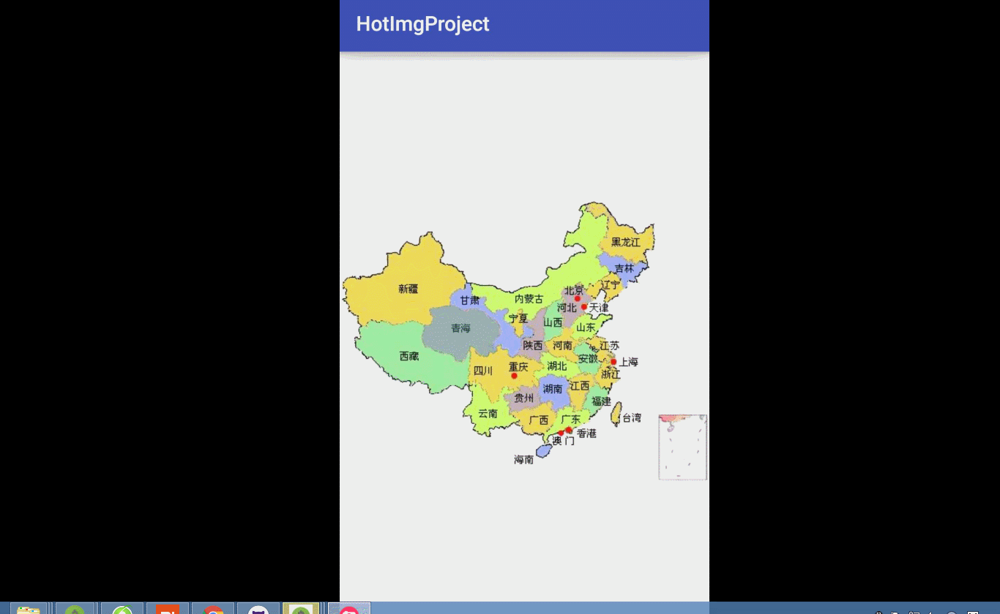

# HotImg
图片不规则区域点击事件处理
# HotImg是基于对一张图片进行不规则区域点击响应不同事件。  
 

# 基本内容  
 1.对图片的部分区域进行可响应事件  
 2.对图片进行缩放后,仍可响应区域点击事件  
 3.对图片进行移动后.仍可响应区域点击事件  
 4.当图片移出边界区域后,可进行回弹.  
 
# 如何使用  
1、 xml配置  
```java
    <com.dreamlive.hotimglibrary.view.HotClickView
        android:id="@+id/a_main_hotview"
        android:layout_width="match_parent"
        android:layout_height="match_parent"
        />
```
2、 禁止缩放  

```java
       mHotView.setCanScale(false);
```
3、 禁止滑动  

```java
       mHotView.setCanMove(false);
```
4、 设置监听事件  
```java
        mHotView.setOnClickListener(new HotClickView.OnClickListener() {
            @Override
            public void OnClick(View view, HotArea hotArea) {
                Toast.makeText(MainActivity.this, "你点击了" + hotArea.getDesc(), Toast.LENGTH_SHORT).show();
            }
        });
```
5、 图片点击区域的设置  
将图片中每个点击区域的像素坐标点配置assets文件下的xml中，例如一张图片像素800X600，在其坐上方（从左上方顶点开始）有一个50x50的正方形点击区域，那么他们pts为{0,0,0,50,50,50,50,0}也就是正方形的四个区域。  

# Thanks  
Everyone who has contributed code and reported issues and pull requests!  
